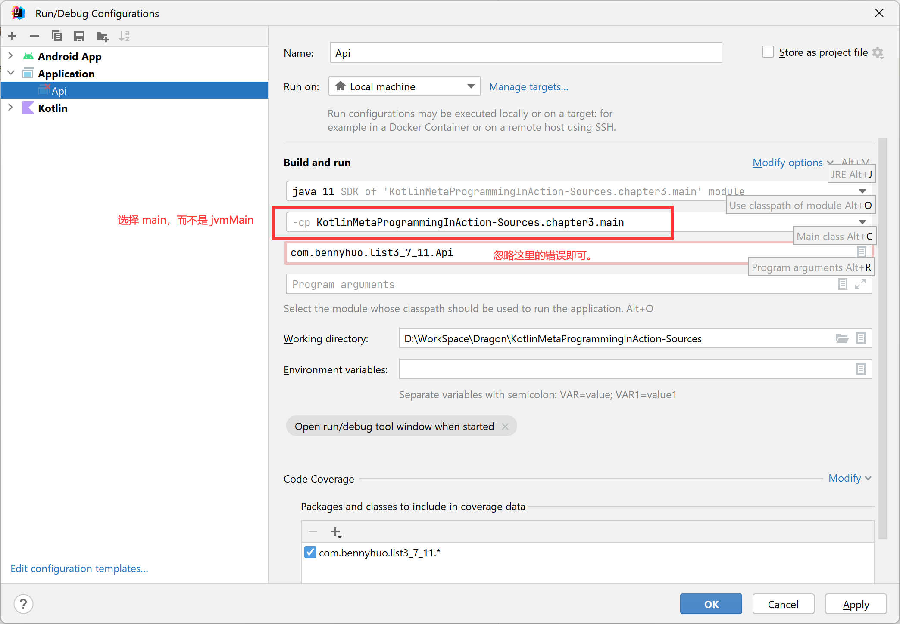

# Chapter 3

### 程序运行说明：

由于本章的工程为 Kotlin 多平台架构，因此直接在 IntelliJ IDEA 中运行 Java 类的 main 方法可能会遇到 sourceSet 找不到的问题，这是 IntelliJ IDEA 的 bug。

运行 Java 的 main 方法时，在 Run Configuration 里面 -cp 选项中选择 main 模块，不要选择 jvmMain，点击 OK 保存之后运行这个任务即可。

如图所示：

